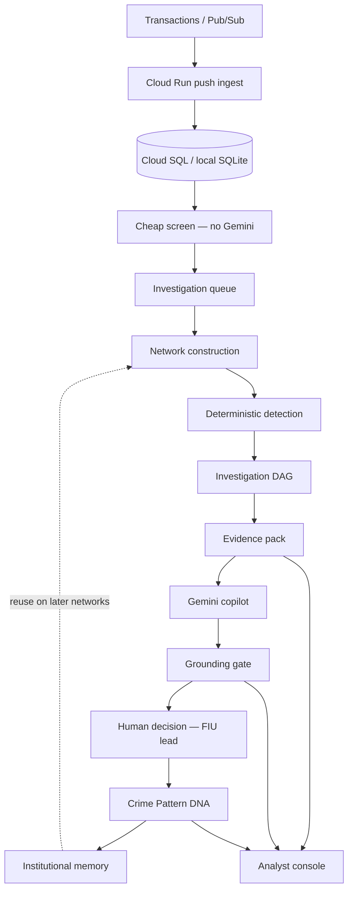

# Corridor Watch

> **The transaction is not the crime. The network is.**

Corridor Watch detects **suspicious transaction networks**, builds a deterministic evidence pack, investigates the graph, grounds Gemini on that evidence, requires a human for consequential actions, and turns confirmed cases into **Crime Pattern DNA** — institutional memory, not a one-off alert.

Gemini is **Evidence → grounding gate → human**, not User → chatbot → answer. Ingest never calls Gemini.

## End-to-end architecture



```text
Transactions / Pub/Sub
     ↓
Cloud Run ingest  (idempotent persist, no Gemini)
     ↓
Cheap screen → investigation queue
     ↓
Network construction
     ↓
Deterministic detection
     ↓
Investigation DAG
     ↓
Evidence pack
     ↓
Gemini copilot
     ↓
Grounding gate
     ↓
Human decision  (FIU lead for hold / escalate / freeze)
     ↓
Crime Pattern DNA
     ↓
Institutional memory
     ↺
Future investigations
```

Detail: [`docs/ARCHITECTURE.md`](docs/ARCHITECTURE.md).

## What it does

1. Detect suspicious networks
2. Build deterministic evidence
3. Investigate the network
4. Ground Gemini on that evidence
5. Require human authorization
6. Convert confirmed cases into Crime Pattern DNA

## Strongest measured results

Canonical scorecard: [`reports/SCORECARD.md`](reports/SCORECARD.md). Judge brief: [`docs/COMPETITION.md`](docs/COMPETITION.md). Claims policy: [`docs/COMPETITION_CLAIMS.md`](docs/COMPETITION_CLAIMS.md). Full narrative: [`FINAL_VALIDATION_REPORT.md`](FINAL_VALIDATION_REPORT.md).

| Claim | Number | Bound |
|---|---|---|
| Dist E / Dist F detection recall | **1.0** on those frozen unseen families | Not “100% accuracy on all fraud” |
| Dist B F1 | **1.0** (was 0.4118) | Seed 7, FPR 0 |
| Dist G GenAI (unknown) | **P 1.0 / R 0.4688 / F1 0.6383 / FPR 0.0** | n=80, 48 benign; all 5 models tied on quality |
| GenAI USD winner | **`gemini-2.5-flash` at $0.00201/case** | Dist G; agreement pack also selects flash |
| Historical single-model agreement | **1.0, n=100**, p95 4.025 s, **$0.00143**/case | `gemini-2.5-flash` only — not the 5-model comparison |
| DeepEval | **205 cases** | custom metrics |
| Official Gemini Faithfulness | **n=10** | not 205 Gemini-judged cases |
| Sustained ingest under SLO | **814 TPS** | 5,000 TPS is a **target, not achieved** |

All competition benchmark artifacts are frozen one-shot evaluations. Subsequent code changes are not used to alter or replace benchmark results.

## GenAI model benchmarking (latest)

Absolute 5-model comparison (methodology: [`docs/GENAI_MODEL_BENCHMARK.md`](docs/GENAI_MODEL_BENCHMARK.md)). Winner on **USD $/case** with equal Dist G quality: **`gemini-2.5-flash`**. Dist G recall **0.4688** is honest: GenAI agrees with the DAG (agr=1.0) and does not recover novel `tarmac_drip` detector misses.

### Dist G — unknown holdout (P / R / F1 / FPR / USD)

Seed 53, n=80 (32 fraud / 48 benign). Novel families disjoint from Dist A–F and golden. Artifact: [`reports/genai_dist_g_bakeoff.md`](reports/genai_dist_g_bakeoff.md).

| Model | P | R | F1 | FPR | $/case | p95 ms |
|---|---:|---:|---:|---:|---:|---:|
| `gemini-2.5-flash` ★ | 1.0 | 0.4688 | 0.6383 | 0.0 | **0.002012** | 6720 |
| `gemini-3.8-flash` | 1.0 | 0.4688 | 0.6383 | 0.0 | 0.003233 | 73814 |
| `gemini-3.6-flash` | 1.0 | 0.4688 | 0.6383 | 0.0 | 0.004128 | 7911 |
| `gemini-2.5-pro` | 1.0 | 0.4688 | 0.6383 | 0.0 | 0.010252 | 10153 |
| `gemini-3.1-pro-preview` | 1.0 | 0.4688 | 0.6383 | 0.0 | 0.018887 | 16499 |

### Agreement + USD (golden n=100 replica)

Same investigate path as historical `gemini_agreement`, once per model. Artifact: [`reports/genai_agreement_cost_bakeoff.md`](reports/genai_agreement_cost_bakeoff.md).

| Model | Agreement | $/case | p95 ms | Alert FPR |
|---|---:|---:|---:|---:|
| `gemini-2.5-flash` ★ | 1.0 | **0.002032** | 6654 | 0.0 |
| `gemini-3.8-flash` | 1.0 | 0.003405 | 15377 | 0.0 |
| `gemini-3.6-flash` | 1.0 | 0.004045 | 10029 | 0.0 |
| `gemini-2.5-pro` | 0.99 | 0.010631 | 10377 | 0.022 |
| `gemini-3.1-pro-preview` | 1.0 | 0.018758 | 16218 | 0.0 |

## 5-minute local demo

```bash
git clone https://github.com/aritracodesbad123/corridor-watch.git
cd corridor-watch
python3 -m venv .venv && source .venv/bin/activate
pip install -r requirements.txt
cp credentials.example.json credentials.json
python data_gen.py
python graph_features.py
# optional: export GEMINI_API_KEY=...  (DAG works without it)
uvicorn main:app --reload --port 8080
```

Open http://localhost:8080 — sign in as `fiu_lead` / `change-me-fiu` (from the example file).

Demo path (3–5 min, one case): **Home (network lights up) → Investigations (graph + money flow) → deterministic evidence → Gemini on that evidence → grounding → confirm → export → Pattern DNA library.** Full script: [`docs/COMPETITION.md`](docs/COMPETITION.md).

Cloud Run: [`docs/CLOUD_RUN.md`](docs/CLOUD_RUN.md). Do not put API keys in the image or in git.

## Known limitations

- Synthetic data only.
- 814 TPS measured; 5,000 TPS is a target.
- Dist C/D have frozen false-positive weaknesses.
- Investigation-path recall = 0.667.
- Exact novel taxonomy classification remains imperfect (Dist F name-match 0; eval-only taxonomy 0.25).
- PITR-to-past not measured.
- Official Gemini Faithfulness n=10.

Dist F `pattern_accuracy` is exact Pattern DNA label agreement. `taxonomy_accuracy` is a pre-declared eval-only family map. Unmapped families stay novel. Dist F names were not added as runtime DNA labels.

## Authentication

The console is password-authenticated. Copy `credentials.example.json` to `credentials.json` (gitignored). Roles: `analyst`, `fiu_lead`, `mrm_auditor`. High-risk freeze/hold/escalate requires `fiu_lead`.

## Deploy

```bash
export GEMINI_API_KEY="your_key"   # Secret Manager only; not in the image
./scripts/deploy_cloud_run.sh YOUR_PROJECT_ID asia-southeast1
```

SQLite is local-only. Cloud Run requires Cloud SQL PostgreSQL. Report only measured `achieved_tps`.

More: [`docs/ARCHITECTURE.md`](docs/ARCHITECTURE.md), [`docs/CLOUD_RUN.md`](docs/CLOUD_RUN.md), [`FINAL_VALIDATION_REPORT.md`](FINAL_VALIDATION_REPORT.md).
